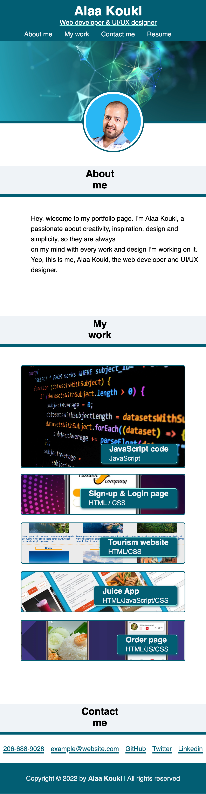

# Alaa-Kouki-portfolio
Hey!! I'm Alaa, welcome to my portfolio. Your gate to my world!
A basic portfolio designed by passion with what I learned so far
in bootcamp using HTML & CSS in addition will keep developing it
through my journey in the course.

## Projects
Projects mentioned in webpage are my designs, designed by using Adobe XD
and I'm looking forward for the day that can make them full applications
and this dream will be very soon with developing myself and work hard in
bootcamp course.

## Codes

You are welcome to check HTML & CSS codes (till now) as it will keep improve
with every step in Bootcamp, you will find :
* CSS variables.
* Flexbox.
* Media queries. 

## Mock-up
Portfolio webpage URL: https://alaakouki.github.io/Alaa-Kouki-portfolio/

The following image shows the web application's appearance for Users on desktop & mobile screens:

